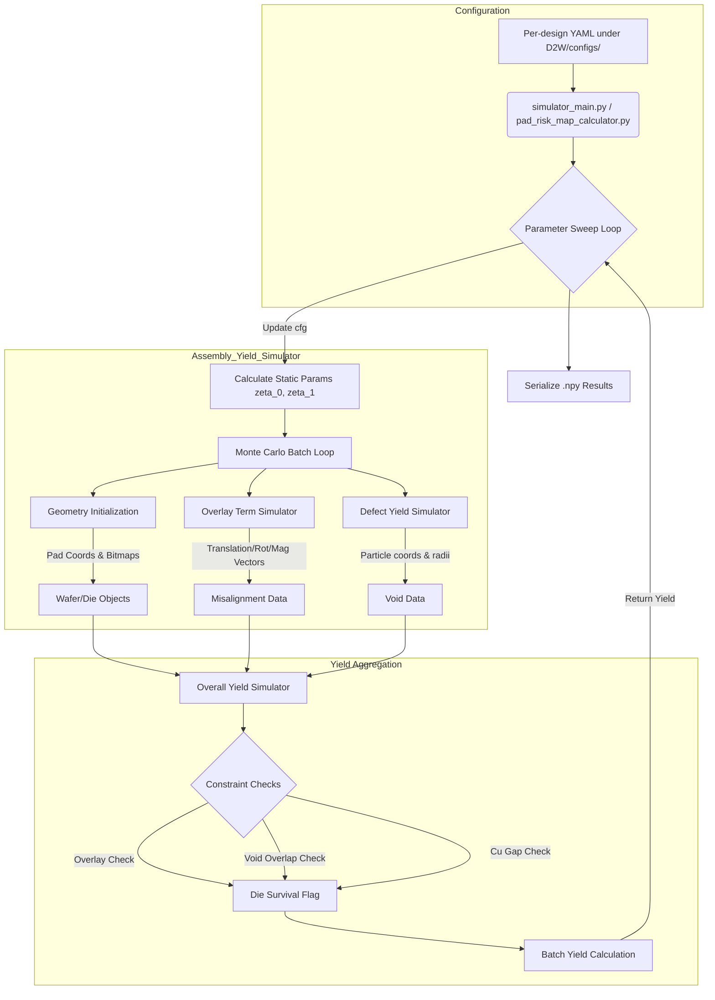
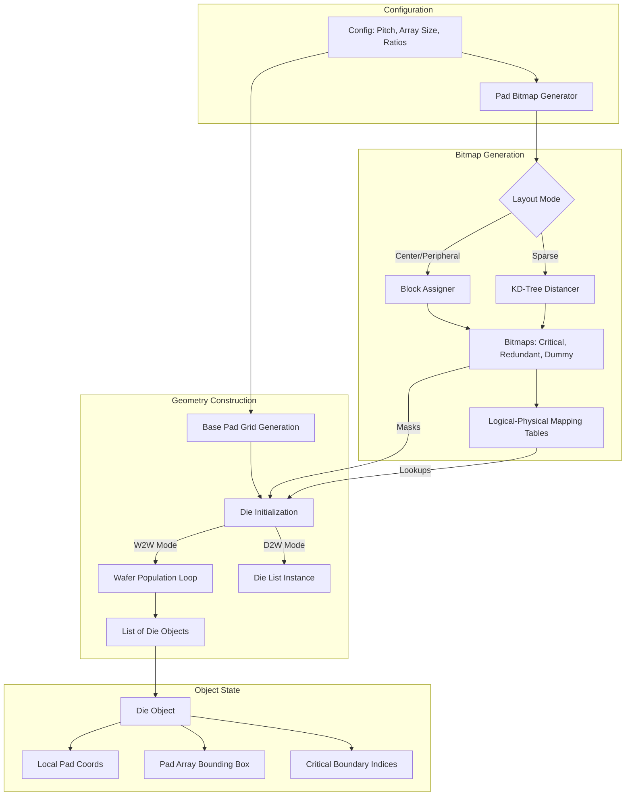
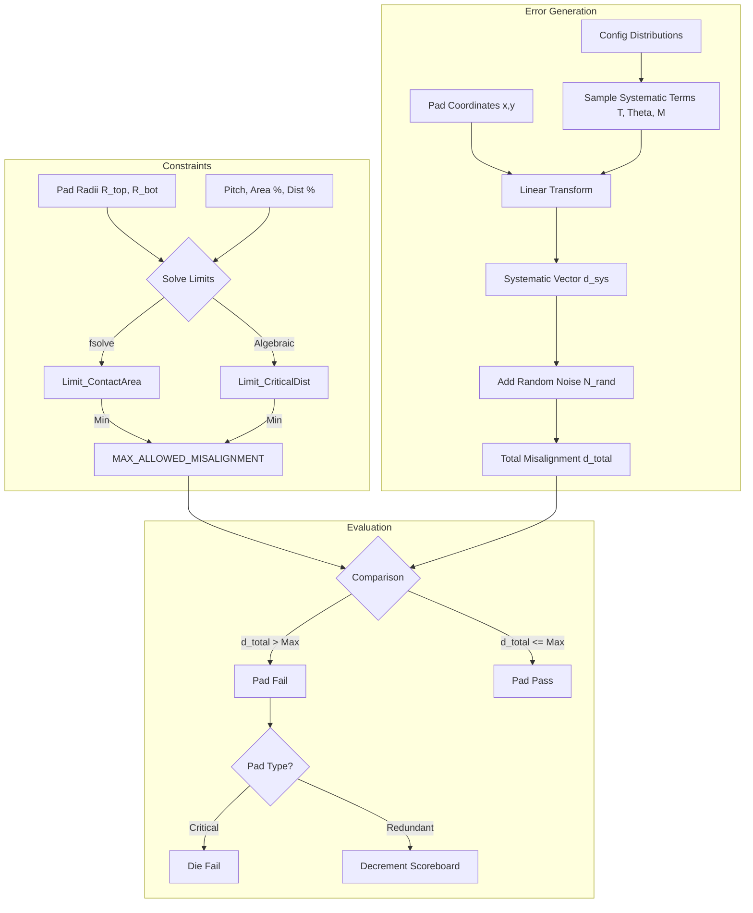
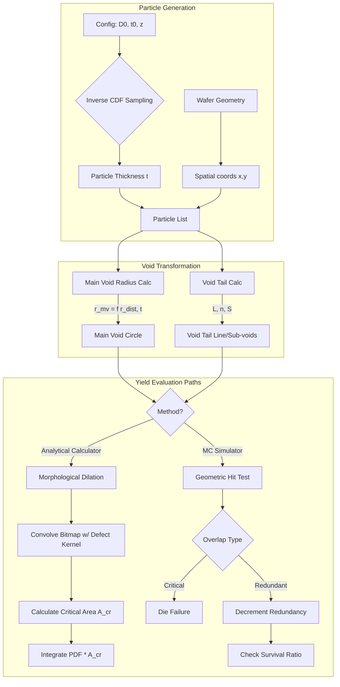
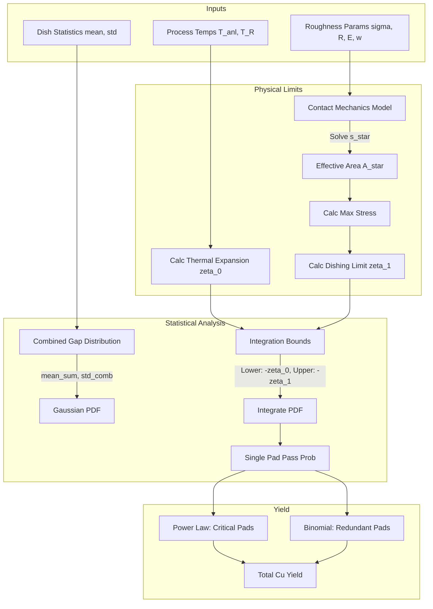
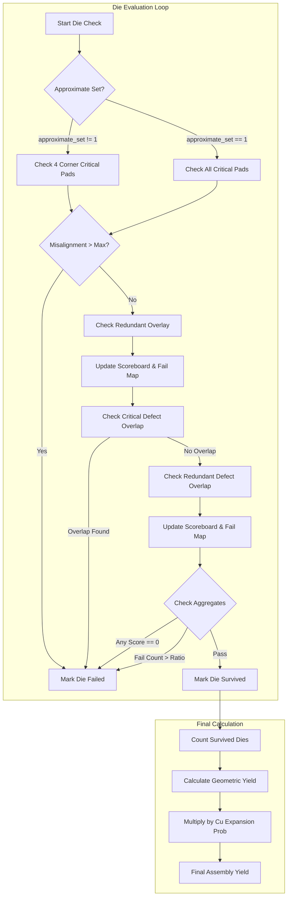

# Hybrid Bonding Yield Analysis Platform: Technical Documentation

> Repository status note (updated for the current codebase on 2026-04-16): this document originally described an earlier `design_1 / design_2`-centric workflow. The active D2W flow in the current repository is centered on `design_1_p5`, `design_2_p10`, `HBM_A`, and `HBM_B`, while legacy datasets and configurations are kept under `D2W/configs/old_configs/` and `D2W/input/old_*` style directories where applicable.

## Current Codebase Snapshot

The current D2W implementation is organized around a small set of actively maintained design families and a set of shell wrappers that drive reproducible modeling and simulation sweeps.

### Active design families

*   `design_1_p5`
    *   Fine-pitch version of `design_1`
    *   Ratio-based input directories under `D2W/input/design_1_p5/`
    *   Current ratio folders:
        *   `c0_r20_pg60_dm20`
        *   `c5_r10_pg60_dm25`
        *   `c10_r0_pg60_dm30`
*   `design_2_p10`
    *   Fine-pitch version of `design_2`
    *   Ratio-based input directories under `D2W/input/design_2_p10/`
    *   Current ratio folders:
        *   `c0_r20_pg60_dm20`
        *   `c5_r10_pg60_dm25`
        *   `c10_r0_pg60_dm30`
*   `HBM_A`
    *   Variant folders directly under `D2W/input/HBM_A/`
    *   Active variants: `Original`, `Center_IO`, `Edge_IO`, `Random_IO`
*   `HBM_B`
    *   Variant folders directly under `D2W/input/HBM_B/`
    *   Active variants: `Original`, `Center_IO`, `Edge_IO`, `Random_IO`

### Current execution entry points

The main D2W entry points in the current repository are:

*   `D2W/pad_risk_map_calculator.py`
    *   Generates analytical pad-level risk maps
*   `D2W/simulator_main.py`
    *   Runs Monte Carlo assembly yield simulation
*   `D2W/run_design_pad_risk_maps.sh`
    *   Serial modeling wrapper for one or more designs
*   `D2W/run_all_pad_risk_maps_parallel.sh`
    *   Parallel modeling wrapper for full sweeps
*   `D2W/run_design_simulations.sh`
    *   Serial simulation wrapper for one or more designs
*   `D2W/run_design_1_p5_design_2_p10_hbm_parallel.sh`
    *   Parallel simulation wrapper for `design_1_p5`, `design_2_p10`, `HBM_A`, and `HBM_B`

### Current sensitivity / paper-figure utilities

The following scripts are part of the active workflow for paper figures and focused parameter studies:

*   `D2W/run_design1_p5_esd_sensitivity.sh`
*   `D2W/run_design1_p5_esd_sensitivity_parallel.sh`
*   `D2W/run_design2_p10_particle_sensitivity.sh`
*   `D2W/run_design2_p10_particle_sensitivity_parallel.sh`
*   `D2W/utils/paper/plot_esd_sensitivity.py`
*   `D2W/utils/paper/plot_particle_sensitivity.py`

### Generated run-specific configuration files

During modeling or simulation, the code may generate interface-specific configuration files such as:

*   `Compute_Small_From_Substrate_Silicon__design_1_p5__default.yaml`
*   `Compute_Large_3_From_Substrate_Organic__design_2_p10_overlay_pessimistic__default.yaml`
*   `HBM_footprint_A__HBM_A__default.yaml`

These generated YAMLs are written under the corresponding design folder in `D2W/configs/` and include the suffix:

*   `__<config_stem>__<criticality_profile>`

This naming scheme is intentional and prevents cross-run overwrites when multiple parameter sets share the same base interface definition.

## Table of Contents

1.  [**System Architecture and Simulation Flow**](#1-system-architecture-and-simulation-flow)
    *   [Entry Points and Configuration Management](#entry-points-and-configuration-management)
    *   [The Assembly Yield Simulation Loop](#the-assembly-yield-simulation-loop)
    *   [Analytical Calculators vs. Monte Carlo Simulators](#analytical-calculators-vs-monte-carlo-simulators)
    *   [Data Structures for Yield Aggregation](#data-structures-for-yield-aggregation)

2.  [**Wafer, Die, and Pad Initialization**](#2-wafer-die-and-pad-initialization)
    *   [Geometric Coordinate Systems (Wafer vs. Die frames)](#geometric-coordinate-systems)
    *   [Pad Bitmap Generation and Downsampling](#pad-bitmap-generation-and-downsampling)
    *   [Redundancy Allocation Logic (Clustering and Multi-to-One mapping)](#redundancy-allocation-logic)
    *   [Boundary Conditions for Critical Areas](#boundary-conditions-for-critical-areas)

3.  [**Overlay Yield Modeling**](#3-overlay-yield-modeling)
    *   [Systematic vs. Random Misalignment Models](#systematic-vs-random-misalignment-models)
    *   [Constraint Logic: Contact Area and Critical Distance](#constraint-logic-contact-area-and-critical-distance)
    *   [D2W vs. W2W Alignment Mechanisms](#d2w-vs-w2w-alignment-mechanisms)
    *   [Yield Calculation: Analytical Integration vs. Geometric Approximation](#yield-calculation-analytical-integration-vs-geometric-approximation)

4.  [**Defect and Void Yield Modeling**](#4-defect-and-void-yield-modeling)
    *   [Particle Size Distributions and Density Models ($D_0$)](#particle-size-distributions-and-density-models-d_0)
    *   [Void Mechanics: Main Voids and Void Tails](#void-mechanics-main-voids-and-void-tails)
    *   [Monte Carlo Critical Area Estimation](#monte-carlo-critical-area-estimation)
    *   [Dilation-based Defect Interaction Logic](#dilation-based-defect-interaction-logic)

5.  [**Copper Expansion and Surface Roughness**](#5-copper-expansion-and-surface-roughness)
    *   [Thermal Expansion Mechanics ($\zeta_0$)](#thermal-expansion-mechanics-zeta_0)
    *   [Surface Roughness and Contact Mechanics ($\zeta_1$)](#surface-roughness-and-contact-mechanics-zeta_1)
    *   [Dishing Distribution Modeling](#dishing-distribution-modeling)
    *   [Gap Closure Criteria](#gap-closure-criteria-and-yield)

6.  [**Yield Aggregation and Redundancy Logic**](#6-yield-aggregation-and-redundancy-logic)
    *   [The "Scoreboard" Mechanism for Logical Pads](#the-scoreboard-mechanism-for-logical-pads)
    *   [Hierarchical Failure Evaluation (Overlay → Defects → Cu Gap)](#hierarchical-failure-evaluation)
    *   [Approximation Sets and Performance Optimization](#approximation-sets-and-performance-optimization)
    *   [Output Metrics and Visualization](#output-metrics-and-visualization)

---

# 1. System Architecture and Simulation Flow

The Hybrid Bonding Yield Analysis Platform (YAP) is a modular Python-based simulation environment designed to quantify yield losses in hybrid bonding processes. The system supports two distinct operational modes: Die-to-Wafer (D2W) and Wafer-to-Wafer (W2W). The architecture separates configuration management, geometry initialization, stochastic error generation, and yield aggregation into discrete modules.

### Entry Points and Configuration Management

In the current codebase, the D2W execution flow is initiated primarily through Python entry points (`D2W/simulator_main.py`, `D2W/pad_risk_map_calculator.py`) and shell wrappers under `D2W/`. These entry points utilize `OmegaConf` to parse per-design YAML files stored under `D2W/configs/<design_name>/`, such as `D2W/configs/design_1_p5/design_1_p5.yaml` or `D2W/configs/HBM_A/HBM_A.yaml`. The configuration object (`cfg`) is passed sequentially to downstream modules and contains physical parameters (dimensions, moduli), process parameters (temperatures, particle densities, voltages, tilt statistics), and simulation settings (iteration counts, batching, map subsampling, and approximation toggles).

The `load_modeling_config()` function in `utils/util.py` loads the configuration and computes derived parameters such as:
*   `PAD_ARR_ROW`, `PAD_ARR_COL`: Number of pads in the array (derived from die dimensions and pitch)
*   `PAD_BOT_R_um`, `PAD_TOP_R_um`: Pad radii (derived from pitch and ratio parameters)
*   `pad_block_size`: Block size for bitmap operations (derived from `pad_block_dim` and pitch)

The main scripts perform parameter sweeps (e.g., varying particle density $D_0$ or pitch) by iterating through defined ranges, updating the `cfg` object, and invoking the `Assembly_Yield_Simulator` for each configuration state. Results are aggregated into yield lists and serialized to `.npy` files for post-processing.

### The Assembly Yield Simulation Loop

The core orchestration logic resides in `Assembly_Yield_Simulator` (in `assembly_yield_simulator.py`). This function encapsulates the Monte Carlo simulation lifecycle. For a given configuration, it performs the following steps:

1.  **Static Parameter Calculation:** Computes physics-based constants that remain invariant across iterations, specifically the thermal expansion limit ($\zeta_0$) and the surface roughness effective contact parameter ($\zeta_1$) via `roughness_parameters()`.
2.  **Batch Iteration:** Executes a loop defined by `cfg.simulation_times`.
3.  **Initialization:** 
    *   **W2W Mode:** Calls `wafer_initialize()` to instantiate `Wafer` objects containing lists of `Die` objects.
    *   **D2W Mode:** Calls `die_initialize()` to instantiate a list of independent `Die` objects.
4.  **Stochastic Injection:**
    *   **Overlay:** Calls `overlay_term_simulator()` to generate global misalignment vectors (translation $X/Y$, rotation $\theta$, magnification $M$) and compute `MAX_ALLOWED_MISALIGNMENT`.
    *   **Defects:** Calls `defect_yield_simulator()` to generate discrete particle coordinates and void radii based on density distributions. Voids are stored in `waf_list[i].voids` (W2W) or `die_list[i].voids` (D2W).
5.  **Yield Evaluation:** Passes the initialized geometry and generated error vectors to `overall_yield_simulator()`, which determines survival based on geometric overlap and critical constraints.

### Analytical Calculators vs. Monte Carlo Simulators

The codebase distinguishes between **Calculators** and **Simulators**.

*   **Simulators** (e.g., `overlay_yield_simulator.py`, `defect_yield_simulator.py`): These function within the Monte Carlo loop. They generate discrete random variables (e.g., a specific misalignment value drawn from a Gaussian distribution) and return coordinate sets or modify object state for specific dies/wafers.
*   **Calculators** (e.g., `overlay_yield_calculator.py`, `defect_yield_calculator.py`, `Cu_expansion_yield_calculator.py`): These perform analytical integration or dense map generation. They use `scipy.integrate.quad` or statistical Cumulative Distribution Functions (CDFs) to compute expected yield probabilities ($Y_{ovl}$, $Y_{df}$, $Y_{Cu}$) and generate spatial yield heatmaps. In the current repository, they are typically invoked through `pad_risk_map_calculator.py`, the modeling branch of the D2W flow, or focused post-processing / paper-figure scripts.

### Data Structures for Yield Aggregation

Yield aggregation relies on specific object classes and dictionaries:

*   **Pad Bitmap Collection:** A dictionary returned by `pad_bitmap_generate_random()` or `convert_3dblox_to_pad_bitmap()` containing:
    *   `CRITICAL_PAD_BITMAP`, `REDUNDANT_PAD_BITMAP`, `DUMMY_PAD_BITMAP`: Dense boolean arrays of shape `(PAD_ARR_ROW, PAD_ARR_COL)`.
    *   `CRITICAL_PAD_BLOCK_BITMAP`: Downsampled bitmap for efficient critical area computation.
    *   `redundant_logical_to_physical_arr`: Lookup table of shape `(Num_Logical, Copies)` mapping logical signals to physical pad IDs.
    *   `redundant_physical_to_logical_arr`: Array of length `Total_Pads` mapping physical pad IDs to logical signal IDs (or -1 for non-redundant pads).
    *   `critical_pad_boundary_bitmap_row_col_block_ind`: Block indices of the four corner critical pads.
*   **Die/Wafer Objects:** These objects maintain state during a simulation iteration.
    *   `Die.pad_array_box`: Bounding box coordinates for critical area checks.
    *   `Die.survival`: Boolean flag toggled to `False` upon constraint violation.
    *   `Die.voids`: List of void coordinates and radii affecting this die.
    *   `Wafer.die_list`: List of `Die` objects on the wafer (W2W mode).
    *   `Wafer.voids`: List of void coordinates and radii on the wafer (W2W mode).
*   **Yield Lists:** `single_config_yield_list` aggregates the yield rates across the Monte Carlo batch to produce a scalar yield percentage for the specific input parameter set.

# 2. Wafer, Die, and Pad Initialization

This section details the construction of the geometric environment used for yield simulation. The system models the physical layout of pads, their aggregation into dies, and the placement of dies upon a wafer (in W2W mode). This initialization phase is deterministic for a given seed and configuration set.

### Geometric Coordinate Systems

The platform utilizes a local-to-global coordinate transformation approach.

*   **Pad Array Generation:** Pad coordinates are generated relative to a die center $(0,0)$. The functions `die_initialize()` (D2W) or `wafer_initialize()` (W2W) construct a grid based on `PAD_ARR_ROW`, `PAD_ARR_COL`, and `PITCH_um`.
    *   $x_{coord} = -\frac{PAD\_ARR\_W\_um}{2} + col \times PITCH\_um$
    *   $y_{coord} = \frac{PAD\_ARR\_L\_um}{2} - row \times PITCH\_um$
*   **Die Objects (`Die` class):** Stores the geometric state of a single die.
    *   `vertices_coords`: Four corners of the die boundary.
    *   `pad_array_box`: Bounding box of the pad array (typically smaller than the die boundary).
    *   `ovl_critical_pad_boundary_coords`: Specific coordinates of the outermost critical pads, used for efficient "worst-case" overlay calculation without iterating through every pad.
*   **Wafer Objects (`Wafer` class):** Used in W2W mode. It procedurally populates a circular area defined by `WAF_R_um` with `Die` objects based on computed `die_center` positions.
*   **Transformation:** Global coordinates for any specific pad are computed dynamically during simulation by broadcasting the die center coordinate to the local pad array: $\vec{P}_{global} = \vec{P}_{base} + \vec{C}_{die}$.

### Pad Bitmap Generation and Downsampling

To manage the complexity of millions of pads, the system uses bitmap masks generated by `pad_bitmap_generate_random()` or loaded via `convert_3dblox_to_pad_bitmap()`.

*   **Bitmaps:** Three primary boolean arrays of shape `(PAD_ARR_ROW, PAD_ARR_COL)` identify pad types:
    1.  `CRITICAL_PAD_BITMAP`: Pads essential for device function.
    2.  `REDUNDANT_PAD_BITMAP`: Pads allocated for signal and power redundancy.
    3.  `DUMMY_PAD_BITMAP`: Mechanical support pads (yield neutral).
*   **Block-Level Abstraction:** To optimize spatial assignment, the pad array is divided into blocks of size `pad_block_size` (derived from `pad_block_dim / PITCH_um`). Pad spatial assignment patterns (Peripheral, Center, Sparse) are calculated at the block level using `assign_pad_blocks()`, then projected to the full pixel bitmap.
*   **Downsampling:** For rapid critical area integration in defect simulations, `downsample_bitmap()` creates coarse-grained versions of the maps using max-pooling (OR-pooling) logic.

### Redundancy Allocation Logic

The system implements complex logic to map **Logical Pads** (signals) to **Physical Pads** (bumps). This logic handles the "Scoreboard" mechanism used later in yield calculation.

*   **Cluster-Based Allocation:** If `redundant_logical_pad_dist` allows, main pads and their copies are placed within the same block or adjacent clusters.
*   **KD-Tree Allocation:** If the required distance between a signal and its redundant copy exceeds block dimensions, the system builds a `scipy.spatial.KDTree` of pad block coordinates. It queries this tree to find block pairs separated by at least `redundant_logical_pad_dist`.
*   **Mapping Arrays:**
    *   `redundant_logical_to_physical_arr`: A lookup table of shape `(Num_Logical, Copies)`. Row $i$ contains the physical IDs of all bumps associated with logical signal $i$.
    *   `redundant_physical_to_logical_arr`: An array of length `Total_Pads`. Index $j$ returns the logical signal ID for physical pad $j$ (or -1 if not a redundant pad).
*   **Multi-to-One Architecture:** When `multi2one_flag` is True, the allocator assigns multiple main pads to share a single copy pad block, adjusting the mapping arrays to reflect shared redundancy resources.

### Boundary Conditions for Critical Areas

The initialization calculates specific boundary indices to optimize overlay simulation.
*   `critical_pad_boundary_bitmap_row_col_block_ind`: Stores the block indices of the four corners (Top-Left, Top-Right, Bottom-Left, Bottom-Right) of the critical pad region.
*   This pre-calculation allows the overlay simulator to check only the corner pads of the critical region (the "approximate set") to determine die failure, assuming rigid body transformation implies worst-case error at the perimeter.

# 3. Overlay Yield Modeling

The Overlay Yield Modeling module quantifies the probability of electrical failure caused by the misalignment of top and bottom copper pads. This module operates through two distinct computational paths: an analytical calculator for generating probability maps (`overlay_yield_calculator.py`) and a stochastic simulator (`overlay_yield_simulator.py`) for the Monte Carlo assembly loop.

### Systematic vs. Random Misalignment Models

The total misalignment vector $\vec{\Delta}_{total}$ for a specific pad at coordinates $(x, y)$ is modeled as the superposition of systematic rigid-body errors and random placement noise.

1.  **Systematic Components:** The simulator models translation ($T_x, T_y$), rotation ($\theta$), and magnification ($M$). The displacement $(\delta x, \delta y)$ is calculated using a linearized transformation matrix, valid for small angles and magnification factors:
    $$ \delta x = T_x - \theta \cdot y + M \cdot x $$
    $$ \delta y = T_y + \theta \cdot x + M \cdot y $$
    *   **Translation ($T_x, T_y$):** Sampled from Gaussian distributions defined by `SYSTEM_TRANSLATION_{X/Y}_{MEAN/STD}_um`.
    *   **Rotation ($\theta$):** Sampled from `SYSTEM_ROTATION_{MEAN/STD}_rad`.
    *   **Magnification ($M$):** Derived from wafer bow differences. The configuration defines a magnification coefficient $k_{mag}$ and an offset $M_0$.
        $$ M = k_{mag} \cdot \Delta_{bow} + M_0$$

2.  **Random Component:** A Gaussian noise vector $\mathcal{N}(\mu_{rand}, \sigma_{rand})$ is added to the magnitude of the systematic error vector, defined by `RANDOM_MISALIGNMENT_{MEAN/STD}_um`.

### Constraint Logic: Contact Area and Critical Distance

The system dynamically calculates a `MAX_ALLOWED_MISALIGNMENT` threshold based on geometric constraints. This threshold is the tighter (minimum) of two physical limits:

1.  **Contact Area Constraint ($C_{area}$):** Ensures sufficient overlap for electrical connectivity. The code calculates the intersection area $A(d)$ of two circles (radii $R_{top}, R_{bot}$) separated by distance $d$. Using `scipy.optimize.fsolve`, it solves for $d$ such that:
    $$ \frac{A(d)}{\pi R_{top}^2} = C_{area} $$
    where $C_{area}$ is the `CONTACT_AREA_CONSTRAINT` (e.g., 0.5).

2.  **Critical Distance Constraint ($C_{dist}$):** Prevents short circuits between adjacent pads. It calculates the maximum shift allowed before the spacing between a top pad and a neighbor's bottom pad violates the breakdown margin:
    $$ d_{max, CD} = (1 - C_{dist}) \cdot P - R_{top} + (C_{dist} - 0.5) \cdot 2 R_{bot} $$
    where $P$ is the pitch and $C_{dist}$ is `CRITICAL_DIST_CONSTRAINT`.

### D2W vs. W2W Alignment Mechanisms

*   **W2W (Wafer-to-Wafer):** Systematic errors are global. Rotation and magnification effects scale with the distance from the wafer center. A single set of $(T_x, T_y, \theta, M)$ parameters is generated per wafer (indexed by `waf_ind`), affecting all dies simultaneously.
*   **D2W (Die-to-Wafer):** Systematic errors are local placement events. Each die receives independent draws of $(T_x, T_y, \theta, M)$ indexed by `die_ind`. Magnification effects are calculated relative to the die center rather than the wafer center.

### Yield Calculation: Analytical Integration vs. Geometric Approximation

The module calculates yield metrics using two methods:

1.  **Analytical Integration (`overlay_yield_calculator`):**
    Used for generating heatmaps and expected yields. For a given pad at $(x,y)$, it computes the systematic offset magnitude $|\vec{\delta}_{sys}|$. The yield probability is computed by integrating the random error PDF over the allowable margin:
    $$ P_{success} = \Phi\left(\frac{L_{max} - |\vec{\delta}_{sys}| - \mu_{rand}}{\sigma_{rand}}\right) - \Phi\left(\frac{-L_{max} - |\vec{\delta}_{sys}| - \mu_{rand}}{\sigma_{rand}}\right) $$
    where $\Phi$ is the standard normal CDF (`scipy.stats.norm.cdf`) and $L_{max}$ is `MAX_ALLOWED_MISALIGNMENT`.

2.  **Monte Carlo Boolean Check (`overall_yield_simulator`):**
    Used in the main simulation loop. It computes the actual misalignment for critical boundary pads (corners) or all pads depending on `approximate_set`. If any critical pad's total misalignment exceeds `MAX_ALLOWED_MISALIGNMENT`, the die `survival` flag is set to `False`. When `approximate_set != 1`, the check is restricted to the boundary pads of the critical pad array, as rigid-body transformations maximize displacement at the periphery. When `approximate_set == 1`, all pads are checked.

# 4. Defect and Void Yield Modeling

The Defect and Void Yield Modeling module quantifies yield loss resulting from particulate contamination that prevents bonding, creating "voids" in the interface. This module bridges particle physics (distributions) with geometric analysis (critical area) through both analytical integration and discrete Monte Carlo placement.

### Particle Size Distributions and Density Models ($D_0$)

The system operates on the premise that particles of varying thickness $t$ cause voids of varying radii. Particle generation is driven by a power-law probability density function (PDF).

*   **Inverse Transform Sampling:** In `defect_yield_simulator.py`, particle thicknesses are generated using inverse CDF sampling derived from the power law:
    $$ t = \frac{t_0}{(1 - u)^{\frac{1}{z-1}}} $$
    Where:
    *   $u$: A uniform random variable $[0, 1)$.
    *   $t_0$: Minimum particle thickness (`cfg.t_0`).
    *   $z$: Power-law index (`cfg.z`).
*   **Spatial Distribution:**
    *   **W2W:** Particles are distributed via uniform disk sampling ($\theta \in [0, 2\pi]$, $r = R \sqrt{U}$) over the wafer radius `WAF_R_um`.
    *   **D2W:** Particles are distributed uniformly over the die area plus a drop margin.
*   **Total Count:** The total number of particles is derived from the defect density parameter $D_0$ (defects/$\mu m^2$) multiplied by the total area (Wafer area or Total Die area).

### Void Mechanics: Main Voids and Void Tails

The platform models two distinct morphological components of a defect, governed by empirical transfer functions:

1.  **Main Voids:** The primary circular delamination caused by the particle. The radius $r_{mv}$ scales with particle thickness and radial position on the wafer (simulating CMP non-uniformity):
    $$ r_{mv} = (k_r \cdot r_{dist} + k_{r0}) \cdot \sqrt{t} $$
    Where $r_{dist}$ is the distance from the wafer center (W2W) or die center (D2W).

2.  **Void Tails:** Linear streaks of micro-voids trailing the main void, often caused by slurry residue or wiper effects.
    *   **Tail Generation:** Defined by length $L$, area $S$, and count $n$, all scaling with the suare root of the particle thickness $\sqrt{t}$ and the distance from the wafer center $r_{dist}$ via coefficients $k_L, k_S, k_n$.
    *   **Discretization:** The tail is rasterized as a linear array of $n$ sub-voids extending from the main particle coordinates, with radii that increase along the tail.

### Monte Carlo Critical Area Estimation

To calculate the average number of fatal defects ($\lambda$) for analytical yield estimation ($Y = e^{-\lambda}$), the system employs a rigorous morphological approach in `pad_bitmap_generation.py` and `defect_yield_calculator.py`.

*   **Defect Kernels:** The system constructs binary kernels representing the defect shapes (circles for main voids, lines for tails) using `build_struture()`.
*   **Morphological Dilation:** The Critical Area ($A_{cr}$) is computed by dilating the `CRITICAL_PAD_BLOCK_BITMAP` with the defect kernel using `cv2.dilate()`.
    $$ A_{cr}(r) = \sum \text{Dilate}(\text{Bitmap}_{pads}, \text{Kernel}_{defect}(r)) \times \text{PixelArea} $$
*   **Integration:** For void tails, which have orientation dependence, the system integrates the critical area across rotation angles $\theta$ via `A_critical_l_across_theta()`.
*   **Yield Calculation:** The final defect yield is computed by integrating the product of the defect size PDF and the Critical Area function:
    $$ \lambda = \int_{t_{min}}^{\infty} f_{size}(x) \cdot A_{cr}(x) \, dx $$
    $f_{size}(x)$ is the probability density function of the defect with a specific size.

### Dilation-based Defect Interaction Logic

In the runtime `overall_yield_simulator.py`, the interaction between discrete voids and pads is resolved using geometric checks ("Hit Tests"):

1.  **Broad Phase:** A bounding box check (`closest_x`, `closest_y`) filters voids that are too far from the die to matter.
2.  **Narrow Phase:** For voids overlapping the pad array box, the simulator calculates the squared Euclidean distance to every relevant pad center.
3.  **Failure Logic:**
    *   Overlap with **Critical Pad**: Triggers immediate `die.survival = False`.
    *   Overlap with **Redundant Pad**: Marks specific pads in `redundant_pad_fail_map` and decrements the redundancy scoreboard.

# 5. Copper Expansion and Surface Roughness

This module models the vertical dimension of the hybrid bonding process, specifically the interaction between Copper (Cu) pad dishing/protrusion, thermal expansion during annealing, and dielectric surface roughness. The yield is determined by whether the Cu gap closes sufficiently to form an electrical connection without inducing excessive stress that causes dielectric delamination.

### Thermal Expansion Mechanics ($\zeta_0$)

The parameter $\zeta_0$ represents the total potential vertical expansion of the copper pads during the annealing phase. It is treated as a deterministic limit derived from the Coefficient of Thermal Expansion (CTE) and process temperatures.

In `Assembly_Yield_Simulator`, $\zeta_0$ is calculated as:
$$ \zeta_0 = k_{et} \times (T_{anl} - T_{R}) + k_{eb} \times (T_{anl} - T_{R}) $$
Where:
*   $k_{et}, k_{eb}$: Expansion coefficients for top and bottom pads (nm/K).
*   $T_{anl}$: Annealing temperature (`cfg.T_anl`).
*   $T_{R}$: Room temperature (`cfg.T_R`).

This value establishes the physical upper bound for the gap size that can be bridged by thermal expansion.

### Surface Roughness and Contact Mechanics ($\zeta_1$)

The parameter $\zeta_1$ defines the "safe" limit for pad dishing to prevent delamination. It is calculated in `roughness_parameters.py` using a contact mechanics model (a variation of the Greenwood-Williamson model) to account for surface asperities.

1.  **Dimensionless Roughness Parameter ($\theta$):**
    $$ \theta = \frac{E'}{w} \sqrt{\frac{\sigma^3}{R}} $$
    Where $E'$ is the effective Young's modulus (renormalized by 0.5), $w$ is adhesion energy, $\sigma$ is roughness RMS (renormalized by $\sqrt{2}$), and $R$ is asperity radius.

2.  **Effective Contact Area ($A^*$):**
    The module solves for a dimensionless separation parameter $s^*$ using `scipy.optimize.root_scalar` where $P^*(s^*) = 0$, then computes the normalized effective contact area $A^*$ by numerical integration of probability functions `integrand_A` and `integrand_P`.

3.  **Max Acceptable Stress:**
    The maximum stress before delamination is derived from fracture mechanics:
    $$ \sigma_{max} = A^* \times \sqrt{\frac{2 E' w}{t_{dielectric}}} $$

4.  **Gap Limit ($\zeta_1$):**
    The stress constraint is converted into a geometric dishing limit, accounting for pattern density $D_{cu}$ and a peeling coefficient $k_{peel}$:
    $$ \zeta_1 = \left(DISH\_0 - \frac{\sigma_{max}}{k_{peel} \cdot D_{cu}}\right) \times 2 $$
    The result is scaled to nanometers and doubled to account for the sum of top and bottom pads. The final value is clamped to be non-negative.

### Dishing Distribution Modeling

The actual gap between a pair of pads is modeled as a random variable derived from the dishing (recess) depth of the top and bottom wafers.

*   **Distributions:** Top and bottom dishing are modeled as independent Gaussian distributions:
    *   $d_{top} \sim \mathcal{N}(\mu_{top}, \sigma_{top})$
    *   $d_{bot} \sim \mathcal{N}(\mu_{bot}, \sigma_{bot})$
*   **Total Gap:** The total gap $g = d_{top} + d_{bot}$ is therefore Gaussian:
    $$ g \sim \mathcal{N}(\mu_{top} + \mu_{bot}, \sqrt{\sigma_{top}^2 + \sigma_{bot}^2}) $$

### Gap Closure Criteria and Yield

The `Cu_expansion_yield_calculator()` determines the probability that the total gap falls within the allowable process window.

1.  **Integration Limits:**
    The source code defines the integration bounds for the validity of the bond as:
    *   **Lower Limit:** $-\zeta_0$
    *   **Upper Limit:** $-\zeta_1$
    *   *Note on Coordinate System:* The integration of the gap PDF over $[-\zeta_0, -\zeta_1]$ implies a coordinate convention where positive physical expansion corresponds to negative gap values in the statistical frame, or that the input dishing means are expected to be negative (protrusion) for valid bonding.

2.  **Single Pad Probability ($P_{pad}$):**
    $$ P_{pad} = \int_{-\zeta_0}^{-\zeta_1} \text{PDF}_g(x) \, dx $$
    Calculated using `scipy.integrate.quad`.

3.  **Die Yield Aggregation:**
    The final copper yield depends on the survival of critical pads and the redundancy logic:
    $$ Y_{Cu} = (P_{pad})^{N_{critical}} \times \left(1 - (1 - P_{pad})^{k_{copy}}\right)^{N_{redundant\_logical}} $$
    Where $k_{copy}$ is the number of copies per logical redundant pad (`redundant_logical_pad_copy`).

# 6. Yield Aggregation and Redundancy Logic

The final stage of the simulation pipeline integrates the disparate failure modes (Overlay, Defects, and Copper Gap) to determine the binary survival status of each die. This logic resides primarily in `overall_yield_simulator.py` and is characterized by a hierarchical failure evaluation and a specific "Scoreboard" mechanism for handling signal redundancy.

### The "Scoreboard" Mechanism for Logical Pads

To accurately model redundancy, the system differentiates between **Physical Pads** (the actual copper structures on the wafer) and **Logical Pads** (the distinct electrical signals they carry). A logical pad may map to $N$ physical pads (copies).

The aggregation logic uses a scorekeeping data structure to track signal integrity:
1.  **Initialization:** A `redundant_logical_scoreboard` array is created, with length equal to the number of logical redundant signals. Each element is initialized to `redundant_logical_pad_copy` (the integer number of physical replicas per signal).
2.  **Mapping:** The system uses `redundant_physical_to_logical_arr`, a lookup array where index $i$ corresponds to the physical pad ID and the value represents the logical signal ID (or -1 for non-redundant pads like power/ground).
3.  **Decrement Logic:** When a physical redundant pad fails (due to overlay misalignment > limit or void overlap), the system looks up its logical ID and decrements the corresponding index in the scoreboard using `np.bincount()`.
4.  **Failure Condition:** A logical signal is considered failed only if its score reaches 0 (all physical copies have failed).

### Hierarchical Failure Evaluation

The simulator evaluates constraints in a specific order to optimize performance (fail-fast logic). A die is marked as failed (`die.survival = False`) immediately upon violating a critical constraint.

1.  **Overlay Evaluation:**
    *   **Critical Pads:** Evaluated first. If any critical pad's misalignment exceeds `MAX_ALLOWED_MISALIGNMENT`, the die fails.
    *   **Redundant Pads:** Evaluated second. Failures do not immediately kill the die but are recorded in the `redundant_pad_fail_map` and the scoreboard.

2.  **Defect (Void) Evaluation:**
    *   **Critical Pads:** The simulator checks for geometric overlap between voids and critical pads. Any overlap triggers immediate die failure.
    *   **Redundant Pads:** Overlaps are recorded in the `redundant_pad_fail_map` and the scoreboard is updated.

3.  **Aggregation Checks:**
    After processing individual pads, the die survival is re-evaluated against two aggregate thresholds:
    *   **Scoreboard Zero Check:** If `np.any(redundant_logical_scoreboard == 0)`, the die fails (integrity of at least one logical signal is lost).
    *   **Survival Ratio Check:** If the total count of failed physical redundant pads exceeds a specific ratio (`1 - redundant_survival_ratio`), the die fails.

4.  **Copper (Cu) Expansion:**
    Cu expansion yield is calculated analytically using the probability integral (see [Section 5](#5-copper-expansion-and-surface-roughness)) via `Cu_expansion_yield_calculator()` and applied as a multiplicative factor to the geometric yield derived from steps 1-3. It is assumed to be statistically independent of the specific geometric placement of overlay/defect errors. In simulation, the Cu expansion yield is "calculated" rather than "simulated" for efficiency.

### Approximation Sets and Performance Optimization

To handle high-volume Monte Carlo simulations, the overlay logic employs an **Approximation Set** (controlled by `approximate_set` config parameter):

*   **Logic:** Rigid body transformations (rotation/magnification) result in monotonically increasing displacement vectors from the center of rotation. Therefore, the maximum misalignment within a die or a critical block always occurs at the convex hull vertices.
*   **Implementation:** When `approximate_set != 1`, instead of calculating misalignment for every pad in the `CRITICAL_PAD_BITMAP`, the simulator only computes coordinates for the `ovl_critical_pad_boundary_coords` (the 4 corners of the critical pad bounding box). When `approximate_set == 1`, all pads are evaluated.
*   **Validity:** If the corner pads satisfy the alignment constraints, it is mathematically guaranteed that all interior pads also satisfy the constraints. This reduces computational complexity from $O(N_{pads})$ to $O(1)$ per die for the critical check.

### Output Metrics and Visualization

*   **Survival Die Count:** The primary metric is the count of dies where `die.survival == True`.
*   **Yield List:** The `Assembly_Yield_Simulator` returns a list of yield percentages, one for each Monte Carlo batch iteration.
*   **Wafer Visualization:** The `Wafer.draw_wafer_die()` method can visualize the wafer with dies colored by survival status (black for survived, red for failed, green for survived with void occurrence).
*   **Pad Yield Maps:** The `Die` objects can retain internal state (`pad_yield_map` dictionaries) for spatial failure distributions when `pad_yield_flag` is enabled.

